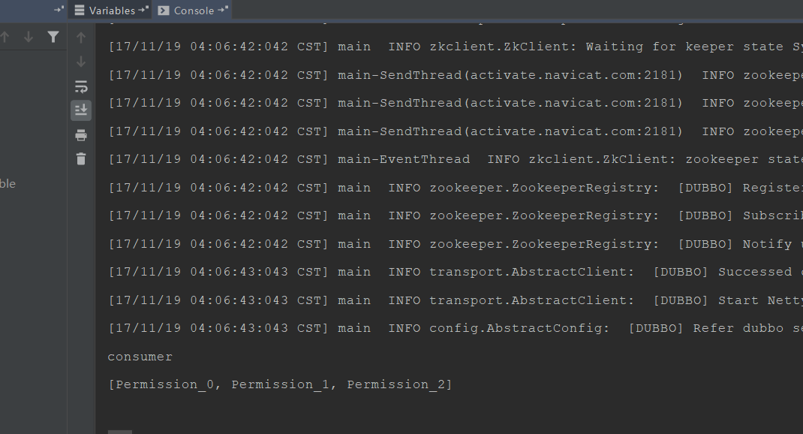

### Dubbo背景和简介

Dubbo开始于电商系统

---
### Dubbo是什么

Dubbo：
* 一款分布式服务框架
* 高性能和透明化的RPC远程服务调用方案
*  SOA服务治理方案

### Dubbo架构

**Provider**: 暴露服务的服务提供方。
**Consumer**: 调用远程服务的服务消费方。
**Registry**: 服务注册与发现的注册中心。
**Monitor**: 统计服务的调用次数和调用时间的监控中心。

**调用流程**

0. 服务容器负责启动，加载，运行服务提供者。
1. 服务提供者在启动时，向注册中心注册自己提供的服务。
2. 服务消费者在启动时，向注册中心订阅自己所需的服务。
3. 注册中心返回服务提供者地址列表给消费者，如果有变更，注册中心将基于长连接推送变更数据给消费者。
4. 服务消费者，从提供者地址列表中，基于软负载均衡算法，选一台提供者进行调用，如果调用失败，再选另一台调用。
5. 服务消费者和提供者，在内存中累计调用次数和调用时间，定时每分钟发送一次统计数据到监控中心

### Dubbo注册中心

对于服务提供方，它需要发布服务，而且由于应用系统的复杂性，服务的数量、类型也不断膨胀；
对于服务消费方，它最关心如何获取到它所需要的服务，而面对复杂的应用系统，需要管理大量的服务调用。
而且，对于服务提供方和服务消费方来说，他们还有可能兼具这两种角色，即既需要提供服务，有需要消费服务。

通过将服务统一管理起来，可以有效地优化内部应用对服务发布/使用的流程和管理。服务注册中心可以通过特定协议来完成服务对外的统一。

**Dubbo提供的注册中心有如下几种类型可供选择**：

* Multicast注册中心
* Zookeeper注册中心
* Redis注册中心
* Simple注册中心

### Dubbo优缺点

**优点：**

1. 透明化的远程方法调用
     像调用本地方法一样调用远程方法；只需简单配置，没有任何API侵入。
2. 软负载均衡及容错机制
     可在内网替代nginx lvs等硬件负载均衡器。
3. 服务注册中心自动注册 & 配置管理
不需要写死服务提供者地址，注册中心基于接口名自动查询提供者ip。
使用类似zookeeper等分布式协调服务作为服务注册中心，可以将绝大部分项目配置移入zookeeper集群。
4. 服务接口监控与治理
Dubbo-admin与Dubbo-monitor提供了完善的服务接口管理与监控功能，针对不同应用的不同接口，可以进行 多版本，多协议，多注册中心管理。

**缺点：**

* 只支持JAVA语言

---
### 启动流程
* 启动zookeeper->启动provider服务->启动consumer服务

---

### 注意事项
* 启动前请先查看IDEA是否可以多项目启动
* 由于dubbo的git现在已经不提供admin可视化服务了，所以请在控制台查看是否启动成功

